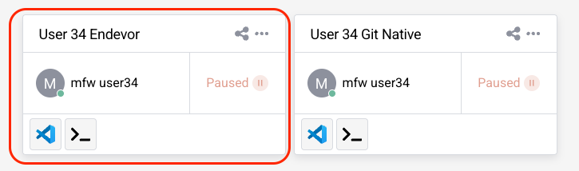
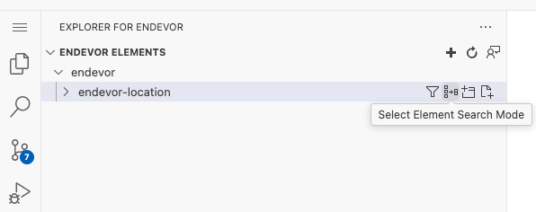

# Code/Build/Debug Challenge
# Main Scenario
## Getting Started

1. Login to the workshop system using the given URL, username, and password, and follow the steps your instructor provides

2. You are in the secure cloud environment which runs VSCode and is connected to the Mainframe
3. Make sure the initial build process has been completed successfully (**exit code: 0** message in the active terminal)
4. Close the terminal from it's right top corner

## Get familiar with the VSCode Activity Bar

## Run the DOGGOS application
Before making any modifications, it is important to understand how the DOGGOS application currently functions. Running the application allows you to verify its expected behavior, ensuring that all dependencies are properly set up and that the build process was successful. This step helps establish a baseline before making any changes so that you can later compare the output after modifications.

1. Go to Zowe Explorer (Z icon in the VSCode Activity Bar)
2. Hover over the “zosmf” item in the DATA SET section in the sidebar and click on the magnifier icon. Enter CUST0xy.PUBLIC in the search field and hit enter (Note: CUST0xy is the mainframe user ID shared by your instructor)
3. Expand the CUST0xy.PUBLIC.JCL data set and right-click on the RUNDOG
4. Select “Submit Job” menu item, then click "Submit" from the pop-up window 
5. Click on the JOB number in the pop-up message in the right bottom corner to see the JOB output (If the notification disappears, you can access it by clicking the bell icon in the bottom-right corner)
6. Expand the “RUNDOG(JOBxxxxx)” in the JOBS section and click on the RUN:OUTREP to browse the program output (If you cannot expand the job output, repeat this step)
7. The report will show the dog breeds categorized. Any breeds not explicitly listed in the COBOL code will fall into the OTHER category.

## Get DOGGOS application from the PROD environment
Before making any changes, we need to retrieve the DOGGOS application from the production environment. This ensures that we are working with the latest version of the code and have a stable baseline before making modifications. Using the Explorer for Endevor extension in VS Code, we will access the COBOL program from the mapped production environment.

1. Open Explorer for Endevor extension from the Activity Bar
2. Wait for the initialization process to complete
3. Expand **endevor** and **endevor-location**, then wait while the system fetches the elements (Note: The connection and location settings have already been pre-configured)
4. You may see a warning indicating that your development sandbox is empty - this is expected
5. Get Endevor elements from the production environment by clicking on the 'Select Element Search Mode' icon

6. There are two options available, we want to retrieve the first elements up the map by selecting 'Only First Found Elements'. The other option, 'All Elements Up the Map', will return all the elements that reside in this sandbox

7. After mapping, your workspace should look like the following screenshot:

8. Locate and expand the COBOL folder 
9. Expand the [MAP] folder to find the COBOL source code associated with your user
10. Right-click the COBOL file, select Edit, and start coding to add a new dog breed

## Edit&Build the DOGGOS application
Once you have the DOGGOS application from production, it’s time to modify the program. This exercise involves adding a new dog breed to the application so that it is correctly categorized in the execution report. After making the necessary COBOL changes, we will build and upload the modified application to the Endevor development environment.

1. Open the COBOL file and locate the relevant section of code
2. Copy the block of code from lines 59-61 (You can use CTRL+G to jump into the given line number)
3. Paste it after line 61
4. Replace JINGO with another dog breed name (e. g. HUSKY) in the whole pasted block of code
5. Update HUSKY-INDEX-VALUE to 9
6. Update OTHER-INDEX-VALUE to 10
7. Change PIC 9(1) to PIC 9(2) for OTHER-INDEX-VALUE
8. Update the OCCURS value in line 71 to 10
9. Copy the block of code from lines 208-210 and paste it after line 210, replacing JINGO with the new breed you defined
10. Copy the block of code from lines 139-142 and paste it after line 143, again replacing JINGO with the new breed you defined
11. Save your changes using CTRL+S (or COMMAND+S on macOS) and bring the file to your sandbox
12. When prompted, approve the Endevor path to upload the COBOL element

13. Enter your mainframe username as the CCID and provide a change comment (e.g., "New breed added")
14. Select **Yes** to generate the object modules

15. Wait for upload&fetch elements

## Link the DOGGOS application
Once the application has been edited and built, the next step is to link it. This step ensures that the newly generated object modules are properly connected, allowing the application to execute successfully.

1. Expand the LNK folder and find the element associated with your user under the [MAP] folder, right click and select Edit

2. Without making any modifications, use CTRL+S (or COMMAND+S) to bring the file to your sandbox
3. When prompted, approve the Endevor path
4. Enter your mainframe username as the CCID and provide a comment (e.g., "Bring link element")
5. Select **Yes** to generate the load modules

6. Wait for upload&fetching elements
7. Collapse the [MAP] folders to see the edited LINK element
8. Your Explorer for Endevor tab should now display the successfully linked application:

## Run the DOGGOS application AFTER the change is made
After modifying, building, and linking the DOGGOS application, it is time to verify that the new dog breed is correctly processed. Running the application allows you to check whether the COBOL changes have been applied successfully and that the program behaves as expected.

1. Go to Zowe Explorer (Z icon in the VSCode Activity Bar)
2. Hover the “zosmf” item in the DATA SET section in the sidebar and click on the magnifier icon. Enter CUST0xy.PUBLIC in the search field and hit enter. Note that CUST0xy is the mainframe user id that is shared by your instructor. 
3. Click on the CUST0xy.PUBLIC.INPUT data set  to edit it
4. Add the following line with the name of the dog breed you chose in the code change (**HUSKY**)

   Please note to enter two records for HUSKY as listed in above screenshot. 

5. Use CTRL+S (or COMMAND+S) to save the change
6. Expand the CUST0xy.PUBLIC.JCL dataset and right-click **NDRUNDOG**
7. Select “Submit Job” menu item, then click "Submit" from the pop-up window
8. Click on the JOB number in the pop-up message at the right bottom corner to see the JOB output (if the notification disappears, you can hit the bell icon from the bottom-right corner to see)
9. Expand the “NDRUNDOG(JOBxxxxx)” in the JOBS section and click on the RUN:OUTREP to browse the program output (If you cannot expand the job output, repeat this step)

The new dog breed “HUSKY” is listed and the counter reports 11 adopted HUSKY dogs. 🎉

## Debug
Bugs can be introduced either during development or when incorrect input data is processed. Debugging helps you analyze and correct such issues by stepping through the code and inspecting variable values. This section will introduce a bug intentionally, and then guide you through using the debugger to identify and fix the issue.

1. Let’s introduce a bug in the program data 🙂 Open the input file again and modify the breed name from “JINGO” to “JINGA”
2. Save your changes using CTRL+S (or COMMAND+S on macOS)
3. Rerun the application repeating the steps in the previous section (from 6th step) 
4. Open the output file and observe that the report is incorrect, the count for JINGO is now 0 and the OTHER category has absorbed the incorrectly named breed
5. Let’s debug the program
6. Open the Debugger Extension by clicking the play icon with a bug  shortcut: CTRL+SHIFT+D (or COMMAND+SHIFT+D)
7. We already have the debugging session preconfigured for the DOGGOS app. Make sure you are using the Endevor configuration from the dropdown

8. Click the play button to start the debugging

9. You will be asked for your Mainframe password. It is the same as your  mainframe userID. Now the debugger will fetch the extended source and start the session.

**Let's identify where the error occurs**

10. The report for the JINGO breed was wrong, so let’s put a breakpoint where the value is updated. Let’s find the first place in the code by searching for JINGO with Ctrl+F (CMD+F on Mac). We can see that processing for the JINGO breed is handled by these variables.
11. Let’s find all instances where JINGO-BREED-NAME is referenced by right-clicking on it and selecting Peek → Peek references. Go through the references to find where the amount is updated. It will be around line 238 in the extended source:

12. Double-click on the 238 line in the editor window to move there.
13. Now set a breakpoint after this condition to see if we get there.

14. The value for OTHER breeds was wrong in the report. Let’s put there a breakpoint as well

15. We now have 2 breakpoints (you can see them in the breakpoints section in the bottom left corner):

16. Now let’s continue the execution by clicking the play button on the left of the debug toolbar (or F5):

17. We can see that while looping through the breeds the debugger skipped the breakpoint on line 239 and stopped at line 245

18. Let’s check the variables. Right-click on the INP-ADOPTED-AMOUNT variable and select “Add to watch”
19. Do the same for the INP-DOG-BREED variable on line 216 to understand which breed is analyzed
20. The watched variables will reveal that JINGA is an incorrect breed name, confirming that the input file is the source of the issue (BTW, a quick way is just to hover over a variable name in your extended source and the value will pop up)

21. Stop the debug session by clicking the stop icon on the debugging toolbar
22. Correct the input file by changing JINGA back to JINGO

